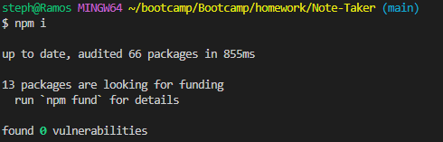
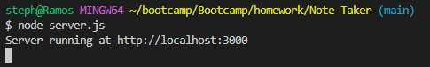
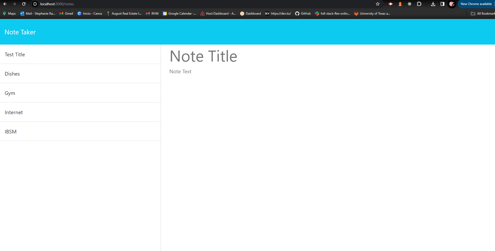

# Note-Taker: Express

# Description
Note Taker is an application built on Express.js, designed for users to write and save. This application helps in organizing thoughts and keeping track of tasks that need to be completed.

# Installation
1. Clone the repository to your local machine: 
- git clone https://github.com/stephaniemnz/Note-Taker.git
2. Navigate to the application directory:
- cd Note-Taker
3. Install Dependencies
- npm i
- 

# Usage
To use the application, start the server in terminal:
- node server.js
- got to http://localhost:3000 to access the Note Taker application.
- 

- 

# Contact
Github: https://github.com/stephaniemnz

